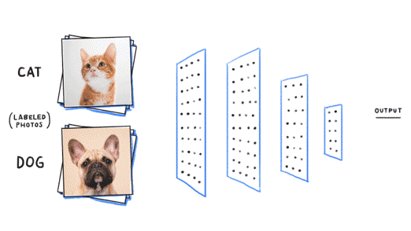
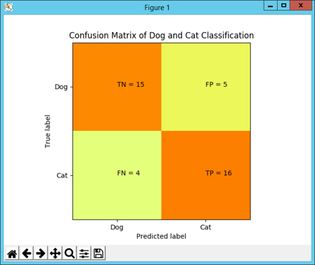
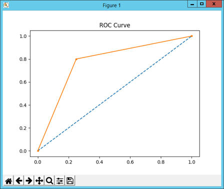

# CNN Classifcation Dog and Cat Using Tensorflow

##model

dataSet for data (images) loading and labelling
main_cnn contains main models for training and testing

for tesing data (images) will be shown in result_test.csv

AUC score = 0.775
Accuracy score =  0.775

